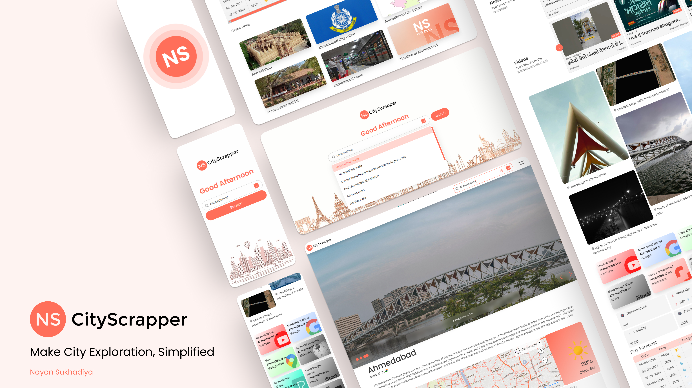

# NS City Scrapper 
Make City Exploration, Simplified

### Why NSCityExplore?
NSCityExplore goes beyond traditional city exploration by offering a holistic platform that
caters to diverse interests and preferences. Whether you're a traveler seeking adventure, a
researcher delving into urban landscapes, or a local eager to discover hidden gems,
NSCityExplore empowers you to unlock the essence of each city with unparalleled ease and
sophistication. Embark on a journey of discovery and redefine how you explore the world,
one city at a time, with NSCityExplore

## Features
- Location autocomplete using Geo Names API
- City images slideshow from Pexels API
- Basic city information from Wikipedia API Endpoint
- City map from Bing Maps API
- Weather forecast from OpenWeatherMap API
- Trending news from NewsData API
- Trending YouTube videos from YouTube API (via RapidAPI)
- Top hotels from Booking.com API (via RapidAPI)
- Detailed city sections (history, finance, geography, airport, etc.) from Wikipedia API
- Direct links to Google search, YouTube search, and more

## Tech Stack
- Frontend: HTML, CSS, JavaScript
- APIs: Geo Names, Pexels, Wikipedia, Bing Maps, OpenWeatherMap, NewsData, YouTube, Booking.com

## API References
- [Geo Names API](https://www.geonames.org/)
- [Pexels API](https://www.pexels.com/api/)
- [Wikipedia API](https://www.mediawiki.org/wiki/API:Main_page)
- [Bing Maps API](https://www.microsoft.com/maps/choose-your-bing-maps-API)
- [OpenWeatherMap API](https://openweathermap.org/api)
- [NewsData API](https://newsdata.io/)
- [YouTube API (Rapid Api)](https://rapidapi.com/omarmhaimdat/api/youtube-v2)
- [Booking.com API (Rapid Api)](https://rapidapi.com/tipsters/api/booking-com)

## Live Demo
Check out the live demo [here](https://nscityscrapper.netlify.app/).
